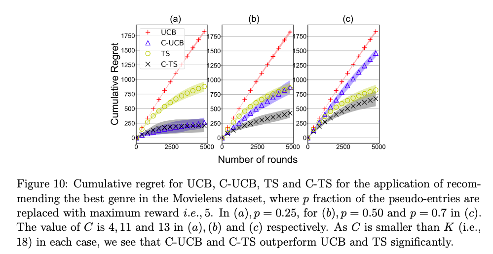
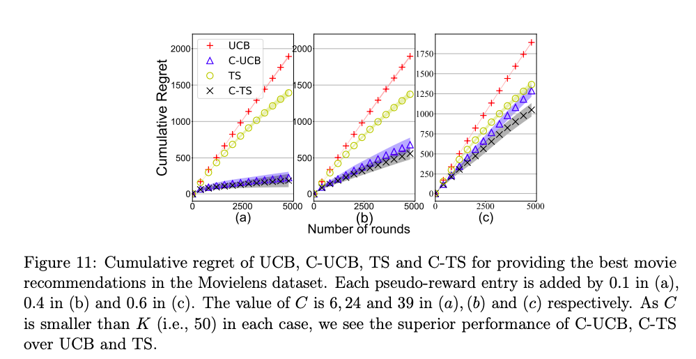
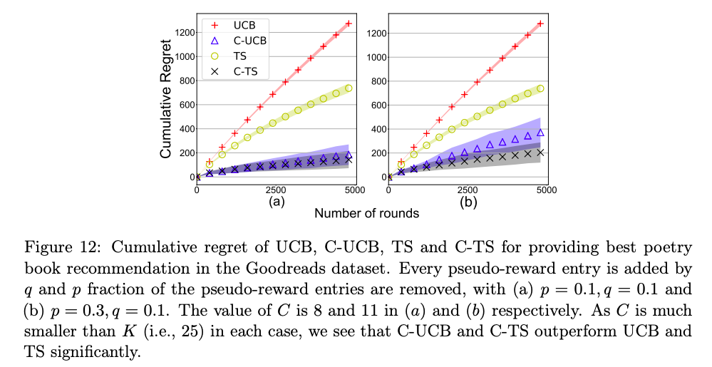

<!-- Ctrl+Shift+M renders it -->
# [Multi-Armed Bandits with Correlated Arms](https://arxiv.org/abs/1911.03959)

<!-- Note that most of the old code was written in Python 2 to kindly feel free to point out any incompatibility to me/raise a PR. -->

**Abstract:** We consider a multi-armed bandit framework where the rewards obtained by pulling different arms are correlated. We develop a unified approach to leverage these reward correlations and present fundamental generalizations of classic bandit algorithms to the correlated setting. We present a unified proof technique to analyze the proposed algorithms. Rigorous analysis of C-UCB and C-TS (the correlated bandit versions of Upper-confidence-bound and Thompson sampling) reveals that the algorithms end up pulling certain sub-optimal arms, termed as non-competitive, only O(1) times, as opposed to the O(log T) pulls required by classic bandit algorithms such as UCB, TS etc. We present regret-lower bound and show that when arms are correlated through a latent random source, our algorithms obtain order-optimal regret. We validate the proposed algorithms via experiments on the MovieLens and Goodreads datasets, and show significant improvement over classical bandit algorithms.

## Requirements
All required modules are listed in <tt>requirements.txt</tt> and can be installed by:
````
pip3 install -U -r requirements.txt
````
### 1. Download the datasets
The datasets can be downloaded as follows:
````
cd data
source download_data.sh
````
This will download the [MovieLens 1M Dataset](https://grouplens.org/datasets/movielens/1m/) and a truncated version of the [Goodreads Poetry Dataset](https://sites.google.com/eng.ucsd.edu/ucsdbookgraph/home). You may edit <tt> download_data.sh</tt> to download different datasets and add necessary preprocessing functions to <tt>preproc/preproc.py</tt>.

### 2. Run preprocessing

Pre-processing as described in the paper can be done with <tt>preproc/preproc.py</tt>. As an example:
```
python preproc.py --movielens --train_test_ratio=0.5
```
will process the MovieLens Dataset with a train-test split of 50:50. For a different dataset, any preprocessing steps may be included in this file.

### 3. Bandit algorithms

Bandit algorithms - UCB, TS, C-UCB, C-TS - can be run from <tt>c_algos.py</tt>. The description of the arguments is:
```
exp             :   Experiment to run (genre, movie, book)
num_iterations  :   Number of iterations of each run
T               :   Number of rounds (horizon)
p               :   Fraction of conditional expectation table entries to mask
pad_val         :   Padding value for the conditional expectation table entries
```
The script saves plots of the generated results in a folder <tt>plot_arrays</tt>.

## Results
Below are some results from MovieLens and Goodreads. For details about the experiments, kindly refer to Section 6 of the [paper](https://arxiv.org/abs/1911.03959).

#### Genre recommendation
<p align=center>

</p>

#### Movie recommendation
<p align=center>

</p>

#### Book recommendation
<p align=center>

</p>
